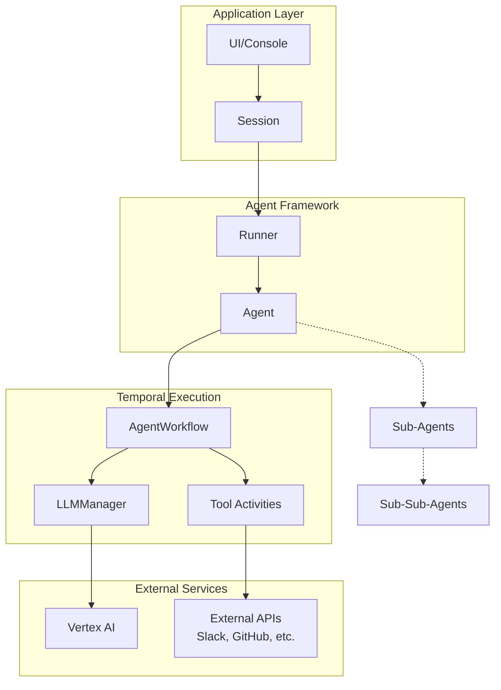

# Temporal Agent Framework

A framework for building AI agents that run on Temporal, providing durable execution, workflow orchestration, and multi-agent coordination.

## Overview

This framework lets you build AI agents that can:
- Execute long-running conversations with memory
- Coordinate multiple specialized sub-agents
- Handle function calls and tool integrations
- Recover from failures and resume execution
- Scale across distributed systems

## Architecture



## Core Concepts

**Agent**: Defines the AI model, instructions, functions, and sub-agents
**Runner**: Manages Temporal worker and workflow execution  
**Session**: Handles workflow lifecycle and provides interaction methods
**LLMManager**: Handles AI model calls as Temporal activities

## Quick Start

```python
from temporal.agent import Agent, Runner, Session, AgentConsole

# Define your tools
def get_weather(location: str) -> str:
    return f"Weather in {location}: Sunny, 72°F"

# Create an agent
agent = Agent(
    name="Weather Assistant",
    model_name="gemini-2.0-flash",
    instruction="You help users get weather information.",
    functions=[get_weather]
)

# Run with console interface
async def main():
    async with Runner(app_name="weather-app", agent=agent) as runner:
        async with Session(client=runner.client, agent=agent) as session:
            await AgentConsole(session=session).run()

asyncio.run(main())
```

## Multi-Agent Example

```python
# Create specialized sub-agents
search_agent = Agent(
    name="Search Specialist",
    instruction="You search for information",
    functions=[search_function],
    input_schema=SearchSchema
)

# Root agent coordinates sub-agents
root_agent = Agent(
    name="Research Assistant", 
    instruction="You coordinate research tasks",
    sub_agents=[search_agent]
)
```

## Examples

- **[Customer Service](examples/customer_service/)** - Simple agent with function calling
- **[GitHub Research](examples/multi_agent_github/)** - Technical code analysis across GitHub
- **[Single Agent Slack](examples/single_agent_slack/)** - Slack integration with one agent
- **[Multi-Agent Slack](examples/multi_agent_slack/)** - Specialized agents for Slack research

## Requirements

- Python 3.12+
- Temporal server
- Google Cloud Vertex AI access

## Setup

1. Install uv if you haven't already:
   ```bash
   curl -LsSf https://astral.sh/uv/install.sh | sh
   ```

2. Start Temporal server:
   ```bash
   temporal server start-dev
   ```

3. Set environment variables:
   ```bash
   export GCP_PROJECT_ID=your-project
   export GOOGLE_APPLICATION_CREDENTIALS=path/to/key.json
   ```

4. Run an example:
   ```bash
   uv run python -m examples.customer_service.console
   ```